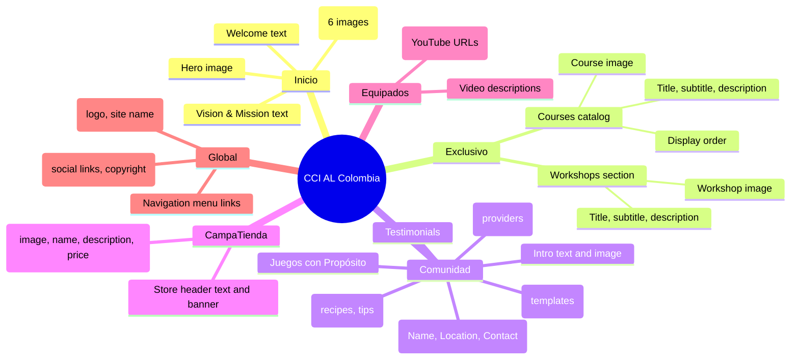
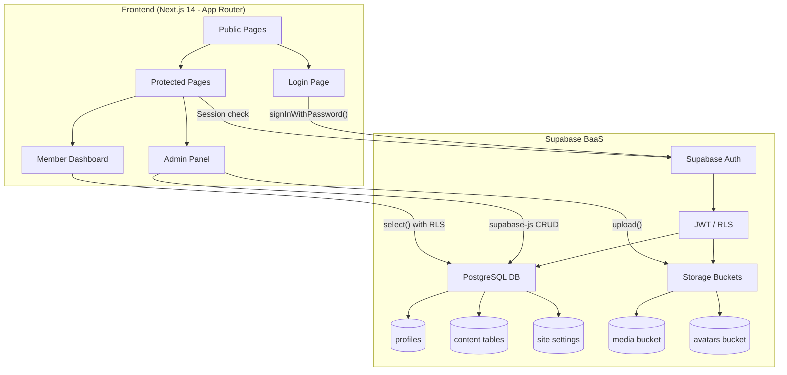
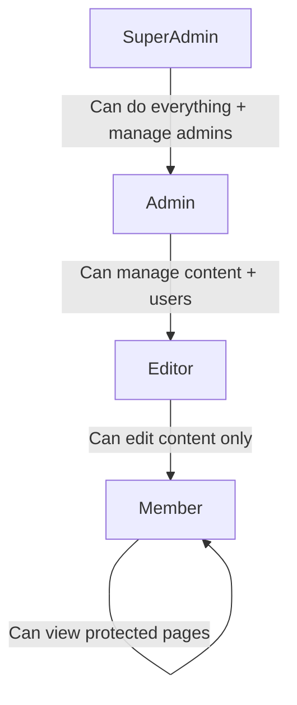
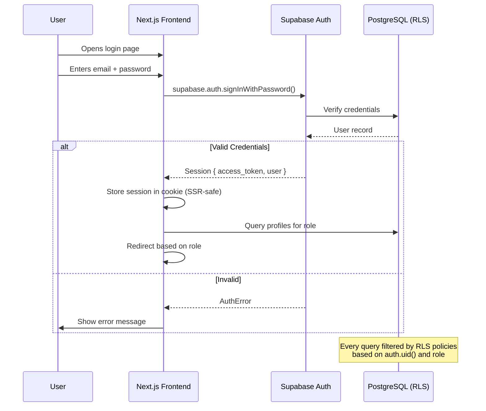

# 🚀 CCI AL Colombia — Static to Dynamic Migration Plan

> **Date:** February 21, 2026 — Revisado: April 6, 2026
> **Status:** PLAN REVISADO — No code changes until approved
> **Current stack:** Static HTML + Bootstrap 5 (Mobirise)
> **Target stack:** Next.js 14 + Supabase (PostgreSQL + Auth + Storage)

---

## 📋 Table of Contents

1. [Executive Summary](#1-executive-summary)
2. [What Can Be Made Dynamic](#2-what-can-be-made-dynamic)
3. [Proposed Architecture](#3-proposed-architecture)
4. [Database Design](#4-database-design)
5. [Authentication & Roles](#5-authentication--roles)
6. [Frontend Plan](#6-frontend-plan)
7. [Backend Plan (API)](#7-backend-plan-api)
8. [Admin Panel — What Each Role Can Do](#8-admin-panel--what-each-role-can-do)
9. [Migration Phases](#9-migration-phases)
10. [Technology Justification](#10-technology-justification)
11. [Hosting & Deployment](#11-hosting--deployment)

---

## 1. Executive Summary

The goal is to transform this **static Mobirise website** into a **dynamic web application** where authorized users can log in with personal credentials, and administrators can update content directly from the browser — without touching HTML files.

### Current Problems Solved by This Migration

| Problem | Solution |
|---------|----------|
| Hardcoded password shared by all users | Individual accounts with hashed passwords |
| Client-side auth (sessionStorage) | Server-side JWT authentication |
| Content changes require editing HTML | Admin panel with online editor |
| No user management | User registration, roles, and permissions |
| No data persistence | PostgreSQL database |
| Stock images and placeholders | CMS-style image upload system |

---

## 2. What Can Be Made Dynamic

After analyzing every page, here is a map of **every content area** that can be stored in the database and edited online:



### Detailed Content Inventory

| Page | Section | Dynamic Content | Admin Action |
|------|---------|----------------|--------------|
| **index.html** | Hero | Banner image, welcome text | Edit text and swap image |
| **index.html** | Login | — | Managed via Auth system |
| **inicio.html** | Gallery | 6 gallery images + captions | Add, remove, reorder images |
| **inicio.html** | Vision & Mission | Text paragraphs | Edit rich text |
| **exclusivo.html** | Courses | 5 course cards (image, title, subtitle, description) | CRUD operations |
| **exclusivo.html** | Workshops | 4 workshop cards (image, title, subtitle, description) | CRUD operations |
| **equipados.html** | Videos | YouTube embed URLs + descriptions | Add, edit, remove videos |
| **comunidad.html** | Fincas | Name, location, contact (currently empty cards) | CRUD operations |
| **comunidad.html** | Transporte | Service name, contact, details | CRUD operations |
| **comunidad.html** | Juegos | Game name, description, rules | CRUD operations |
| **comunidad.html** | Cocina | Recipe name, instructions, tips | CRUD operations |
| **comunidad.html** | Gráficos | Template name, downloadable file | Upload and manage files |
| **comunidad.html** | Testimonials | Author name, photo, quote | CRUD operations |
| **campatienda.html** | Banner | Header image, store description text | Edit text and swap image |
| **campatienda.html** | Products | Product image, name, description, price | CRUD operations |
| **All pages** | Navbar | Menu items, logo | Edit from settings |
| **All pages** | Footer | Social links, copyright text | Edit from settings |

---

## 3. Proposed Architecture

> **Cambio arquitectónico clave:** Al usar Supabase, se elimina la necesidad de un backend Express separado. Supabase provee Auth, PostgreSQL y Storage. La lógica personalizada se maneja con Next.js Server Actions o API Routes.



### Folder Structure

```
ccialcol/
├── app/                           # Next.js 14 App Router
│   ├── (public)/                  # Public routes
│   │   ├── page.tsx               # Landing / index
│   │   └── login/page.tsx
│   ├── (protected)/               # Member-only routes (middleware check)
│   │   ├── inicio/page.tsx
│   │   ├── equipados/page.tsx
│   │   ├── exclusivo/page.tsx
│   │   ├── comunidad/page.tsx
│   │   └── campatienda/page.tsx
│   └── admin/                     # Admin panel (Editor+ only)
│       ├── dashboard/page.tsx
│       ├── users/page.tsx
│       ├── content/page.tsx
│       ├── products/page.tsx
│       └── settings/page.tsx
│
├── components/
│   ├── layout/                    # Navbar, Footer, Sidebar
│   ├── ui/                        # Reusable UI (Bootstrap components)
│   └── admin/                     # Admin-specific components
│
├── lib/
│   ├── supabase/
│   │   ├── client.ts              # Browser-side Supabase client
│   │   ├── server.ts              # Server-side Supabase client (SSR)
│   │   └── middleware.ts          # Auth session refresh
│   └── utils.ts
│
├── middleware.ts                   # Next.js route protection
│
└── supabase/
    ├── migrations/                # SQL migration files
    └── seed.sql                   # Initial data from current HTML
```

---

## 4. Database Design

> **La especificación completa de la base de datos está en [BaseDatos.md](BaseDatos.md)**
> Incluye: esquema SQL completo, políticas RLS, Storage buckets, triggers y seed inicial.

### Cambios clave respecto al diseño original

| Antes (plan original) | Ahora (Supabase-native) |
|-----------------------|------------------------|
| `USERS` con `password_hash` | `profiles` extiende `auth.users` de Supabase (sin passwords en la app) |
| IDs enteros (`int`) | UUIDs (`uuid`, generados con `gen_random_uuid()`) |
| `MEDIA` table custom | Supabase Storage buckets (`media`, `avatars`) |
| Sin seguridad a nivel de BD | Row Level Security (RLS) en todas las tablas |
| Prisma ORM para migraciones | Migraciones SQL directas en Supabase |
| `string` como tipo | `text`, `jsonb`, `timestamptz`, `numeric` (tipos reales PostgreSQL) |

### Resumen del Esquema

```mermaid
erDiagram
    AUTH_USERS ||--|| PROFILES : extends
    PROFILES ||--o{ SITE_SETTINGS : "updated_by"
    PROFILES ||--o{ PAGE_SECTIONS : "updated_by"
    PAGES ||--o{ PAGE_SECTIONS : contains
    PAGES ||--o{ GALLERY_IMAGES : has
    PAGES ||--o{ VIDEO_EMBEDS : has

    PROFILES {
        uuid id PK_FK
        text full_name
        user_role role
        boolean is_active
    }

    PAGES {
        uuid id PK
        text slug UK
        boolean requires_auth
    }

    COURSES {
        uuid id PK
        text title
        course_category category
        boolean is_active
    }

    PRODUCTS {
        uuid id PK
        text name
        numeric price
        boolean is_available
    }

    COMMUNITY_RESOURCES {
        uuid id PK
        community_category category
        text title
        boolean is_active
    }
```

### Decisiones clave del diseño

- **`profiles`** extiende `auth.users` — Supabase Auth maneja contraseñas; la app solo guarda nombre y rol
- **`page_sections.content`** usa `jsonb` — cada tipo de sección guarda una estructura diferente sin cambios de esquema
- **`community_resources.category`** como enum — Fincas, Transporte, Juegos, Cocina y Gráficos en una sola tabla
- **`courses.category`** — separa Cursos de Talleres en la misma tabla
- **RLS en todas las tablas** — la autorización vive en la base de datos, no en el código
- **Supabase Storage** reemplaza la tabla `MEDIA` y el almacenamiento local de archivos

---

## 5. Authentication & Roles

> **Con Supabase Auth:** No se necesita implementar JWT ni bcrypt manualmente. Supabase maneja toda la autenticación y los roles se gestionan a través de la tabla `profiles` y Row Level Security (RLS).

### Role Hierarchy



### Permissions Matrix

| Action | Super Admin | Admin | Editor | Member |
|--------|:-----------:|:-----:|:------:|:------:|
| View protected pages | ✅ | ✅ | ✅ | ✅ |
| Edit own profile | ✅ | ✅ | ✅ | ✅ |
| Edit page content (text, images) | ✅ | ✅ | ✅ | ❌ |
| Add/edit courses & workshops | ✅ | ✅ | ✅ | ❌ |
| Add/edit products (CampaTienda) | ✅ | ✅ | ✅ | ❌ |
| Add/edit community resources | ✅ | ✅ | ✅ | ❌ |
| Manage gallery & media | ✅ | ✅ | ✅ | ❌ |
| Create/edit/delete users | ✅ | ✅ | ❌ | ❌ |
| Assign roles (except superadmin) | ✅ | ✅ | ❌ | ❌ |
| Edit site settings (logo, links) | ✅ | ✅ | ❌ | ❌ |
| Manage navigation & footer | ✅ | ✅ | ❌ | ❌ |
| Delete site data | ✅ | ❌ | ❌ | ❌ |
| Promote to admin | ✅ | ❌ | ❌ | ❌ |

### Auth Flow con Supabase



### Security Measures (Supabase-native)

- **Supabase Auth** — maneja hashing de contraseñas, tokens y sesiones automáticamente
- **Row Level Security (RLS)** — cada tabla tiene políticas que filtran por `auth.uid()` y rol
- **httpOnly cookies** — sesión almacenada con `@supabase/ssr` (nunca expuesta a JS)
- **Rate limiting** — configurado en Supabase Auth dashboard (max intentos por IP)
- **SQL injection** — imposible con el cliente `supabase-js` (queries parametrizados)
- **CORS** — configurado en Supabase project settings

---

## 6. Frontend Plan

### Technology: Next.js 14 (App Router)

#### Why Next.js?
- **Server-Side Rendering (SSR)** for SEO on public pages
- **API routes** can coexist with the frontend (optional)
- **File-based routing** mirrors the current page structure
- **Built-in image optimization** for gallery and product images
- **Middleware** for route protection based on JWT

#### Route Map

| Current Static File | New Next.js Route | Auth Required |
|---------------------|-------------------|:------------:|
| `index.html` | `/` (landing) + `/login` | ❌ |
| `inicio.html` | `/inicio` | ✅ Member+ |
| `equipados.html` | `/equipados` | ✅ Member+ |
| `exclusivo.html` | `/exclusivo` | ✅ Member+ |
| `comunidad.html` | `/comunidad` | ✅ Member+ |
| `campatienda.html` | `/campatienda` | ✅ Member+ |
| *(new)* | `/admin/dashboard` | ✅ Editor+ |
| *(new)* | `/admin/content` | ✅ Editor+ |
| *(new)* | `/admin/users` | ✅ Admin+ |
| *(new)* | `/admin/settings` | ✅ Admin+ |
| *(new)* | `/admin/products` | ✅ Editor+ |

#### Visual Design Approach
- **Keep the current look and feel** — same Bootstrap 5 grid, same color palette, same fonts (Inter, Jost)
- **Componentize** every repeated section (navbar, footer, card grids)
- **Add admin toolbar** — when an Editor/Admin is logged in, each editable section gets a small ✏️ icon to edit inline

---

## 7. Data Access Plan (Supabase Client)

### Technology: Next.js 14 Server Actions + `supabase-js` SDK

> **No se necesita Express.** Toda la lógica de datos se hace directamente con el cliente Supabase en Server Actions o Route Handlers de Next.js. La autorización la aplica RLS en PostgreSQL automáticamente.

#### Patrón de Acceso a Datos

```typescript
// lib/supabase/server.ts — cliente SSR
import { createServerClient } from '@supabase/ssr'

// En un Server Component o Server Action:
const supabase = createServerClient(...)

// Lectura (RLS filtra automáticamente por rol)
const { data: courses } = await supabase
  .from('courses')
  .select('*')
  .eq('is_active', true)
  .order('display_order')

// Escritura (RLS verifica que el usuario sea Editor+)
const { error } = await supabase
  .from('courses')
  .insert({ title, description, category })

// Upload de media
const { data } = await supabase.storage
  .from('media')
  .upload(`courses/${filename}`, file)
```

#### Operaciones por Módulo

| Módulo | Operación | Mecanismo | Autorización |
|--------|-----------|-----------|-------------|
| Auth | Login / Logout | `supabase.auth.signInWithPassword()` | Supabase Auth |
| Auth | Crear usuario (admin) | `supabase.auth.admin.createUser()` | Server Action (Admin+) |
| Auth | Cambiar contraseña | `supabase.auth.updateUser()` | Supabase Auth |
| Usuarios | Listar / editar | `from('profiles').select()` | RLS Admin+ |
| Contenido | CRUD páginas | `from('page_sections')` | RLS Editor+ |
| Cursos | CRUD | `from('courses')` | RLS Editor+ / Member read |
| Productos | CRUD | `from('products')` | RLS Editor+ / Member read |
| Comunidad | CRUD | `from('community_resources')` | RLS Editor+ / Member read |
| Media | Upload | `storage.from('media').upload()` | RLS Editor+ |
| Media | Listar | `storage.from('media').list()` | RLS Editor+ |
| Settings | Leer | `from('site_settings').select()` | Público |
| Settings | Actualizar | `from('site_settings').update()` | RLS Admin+ |

#### Route Handlers necesarios (Next.js `/app/api/`)

Solo se necesitan Route Handlers para operaciones que no pueden hacerse directamente desde el cliente:

| Ruta | Propósito |
|------|-----------|
| `POST /api/auth/callback` | OAuth callback handler (Supabase) |
| `POST /api/admin/users` | Crear usuario vía `supabase.auth.admin` (requiere service role key) |
| `DELETE /api/admin/users/:id` | Eliminar usuario de auth.users (requiere service role key) |

---

## 8. Admin Panel — What Each Role Can Do

### Editor View
```
📊 Dashboard
├── 📝 Content Manager
│   ├── Edit page hero text and images
│   ├── Manage gallery images
│   └── Edit section content (rich text)
├── 📚 Courses & Workshops
│   ├── Add / Edit / Reorder courses
│   └── Add / Edit / Reorder workshops
├── 🛒 Products (CampaTienda)
│   ├── Add / Edit products
│   └── Upload product images
├── 🏕 Community Resources
│   ├── Fincas (CRUD)
│   ├── Transporte (CRUD)
│   ├── Juegos (CRUD)
│   ├── Cocina (CRUD)
│   └── Gráficos (upload & manage)
└── 🖼 Media Library
    └── Upload and browse images
```

### Admin View (includes everything above +)
```
👥 User Management
├── Create new users
├── Assign roles (Editor / Member)
├── Activate / Deactivate accounts
└── Reset passwords

⚙️ Site Settings
├── Logo and site name
├── Navigation menu (add, remove, reorder)
├── Footer social links
└── Copyright text
```

### Super Admin View (includes everything above +)
```
🔐 System Administration
├── Promote users to Admin role
├── Delete content permanently
├── View activity logs
└── Database backup triggers
```

---

## 9. Migration Phases

### Phase 1 — Foundation & Supabase Setup (Week 1–2)
- [ ] Create Supabase project (database + auth + storage)
- [ ] Ejecutar migraciones SQL de [BaseDatos.md](BaseDatos.md) en el SQL Editor de Supabase
- [ ] Configurar Storage buckets (`media`, `avatars`)
- [ ] Set up Next.js 14 project con `@supabase/ssr`
- [ ] Ejecutar seed inicial desde `supabase/seed.sql`

### Phase 2 — Authentication (Week 2–3)
- [ ] Build login page (reemplazando el modal actual)
- [ ] Integrar `supabase.auth.signInWithPassword()`
- [ ] Configurar middleware de Next.js para protección de rutas
- [ ] Crear Route Handler `POST /api/admin/users` para crear usuarios (con service role key)
- [ ] Generar tipos TypeScript con `supabase gen types`

### Phase 3 — Frontend Migration (Week 3–5)
- [ ] Convertir cada página estática a Next.js page
- [ ] Fetch de contenido desde Supabase en Server Components
- [ ] Mantener Bootstrap layout y estilos actuales
- [ ] Agregar toolbar de edición inline para Editor+

### Phase 4 — Content Management (Week 5–7)
- [ ] Server Actions para CRUD de cursos, productos, comunidad
- [ ] Upload de imágenes a Supabase Storage
- [ ] Editor de secciones de página (rich text + imagen)
- [ ] Migrar contenido HTML actual a la DB via seed

### Phase 5 — Admin Panel (Week 7–8)
- [ ] Dashboard con vista general
- [ ] Gestión de usuarios (crear, asignar roles, activar/desactivar)
- [ ] Panel de settings del sitio (logo, nav, footer, redes sociales)
- [ ] Biblioteca de media (listar, subir, eliminar)

### Phase 6 — Testing & Deployment (Week 8–9)
- [ ] Pruebas end-to-end de todos los flujos
- [ ] Verificación de políticas RLS (intentar bypass como member)
- [ ] Deploy frontend en Vercel (conectar con Supabase env vars)
- [ ] Migración DNS y go-live

---

## 10. Technology Justification

| Technology | Why? |
|-----------|------|
| **Next.js 14** | SSR para SEO, App Router con Server Actions, middleware para protección de rutas, deployment fácil en Vercel |
| **Supabase** | PostgreSQL + Auth + Storage en una plataforma — elimina la necesidad de backend Express separado, RLS para seguridad a nivel de BD |
| **`@supabase/ssr`** | Manejo de sesión seguro en cookies httpOnly compatible con Next.js App Router |
| **PostgreSQL (via Supabase)** | Datos relacionales (usuarios → contenido → media), robusto, RLS nativo |
| **Supabase Storage** | Almacenamiento de archivos integrado con las mismas políticas de seguridad que la DB |
| **Bootstrap 5** | Ya usado en el sitio actual — cero disrupción visual durante la migración |

### Alternatives Considered

| En vez de | Se podría usar | Por qué no |
|-----------|---------------|------------|
| Supabase | Firebase | Menos control sobre datos; no tiene SQL real; más costoso a escala moderada |
| Supabase | Express + PostgreSQL manual | Requiere mantener un servidor, implementar auth manualmente, más complejidad |
| Next.js | Plain React + Vite | Pierde SSR y SEO; más configuración manual |
| Supabase Storage | Cloudinary | Costo adicional; fragmentación de servicios; Supabase Storage es suficiente para este caso |
| Supabase Auth | Auth.js (NextAuth) | Supabase Auth ya está integrado; evita configuración adicional |

---

## 11. Hosting & Deployment

### Recommended Setup (Supabase-first)

| Componente | Servicio | Costo |
|-----------|---------|------|
| Frontend + API Routes | **Vercel** (free tier) | $0/mes |
| Base de datos + Auth + Storage | **Supabase** (free tier: 500 MB DB, 1 GB storage) | $0/mes |
| Dominio | Dominio actual | Ya poseído |

**Costo estimado: $0/mes** en el tier gratuito (vs. $5–15/mes del plan original)

### Límites del Free Tier de Supabase
| Recurso | Límite gratuito | Suficiente para? |
|---------|----------------|-----------------|
| Base de datos | 500 MB | Sí — contenido de la app cabe en < 50 MB |
| Storage | 1 GB | Sí — para imágenes del sitio |
| Usuarios Auth | Ilimitado | Sí |
| Bandwidth | 5 GB/mes | Sí — sitio de comunidad pequeña |
| Edge Functions | 500K invocaciones/mes | Sí |

> Si el proyecto escala, Supabase Pro es $25/mes con 8 GB DB + 100 GB storage — aún más económico que el plan original de $5–15/mes.

---

> [!IMPORTANT]
> **No changes have been made to the project.** This document is a plan for your review.  
> Once approved, I will begin implementation starting with Phase 1.

---

*Plan created: February 21, 2026*
